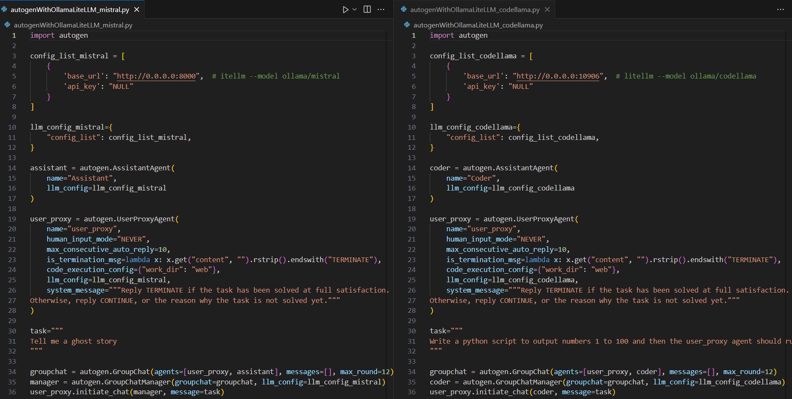

# Ollama LiteLLM
Try two model "codellama" and "mistral" in Ollama with LiteLLM module via ollama module


Follow the [video](https://www.youtube.com/watch?v=xa8pTD16SnM) to install Phi model to customize my owm LLM <br>
```
ollama show phi --modelfile >arr-modelfile
ollama create arr-phi --file arr-modelfile 
```

Follow the [video](https://www.youtube.com/watch?v=d1kgnsO2yUs) to run local LLM anywhere with ollama webUI 
Installing with Docker 
If Ollama is on your computer, use this command: <br>
```
docker run -d -p 3000:8080 --add-host=host.docker.internal:host-gateway -v ollama-webui:/app/backend/data --name ollama-webui --restart always ghcr.io/ollama-webui/ollama-webui:main
```
